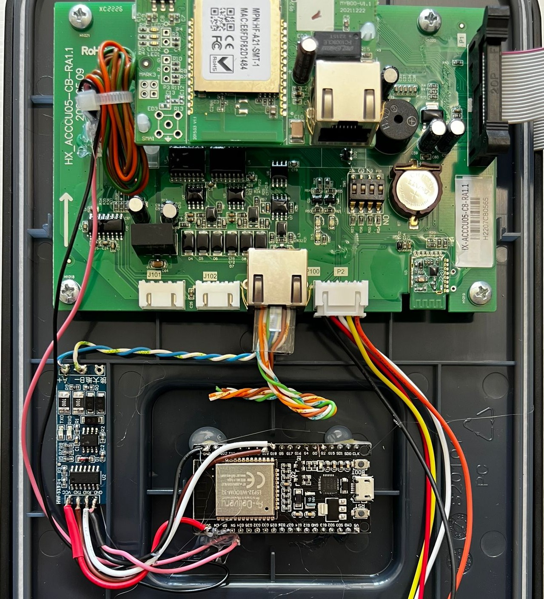
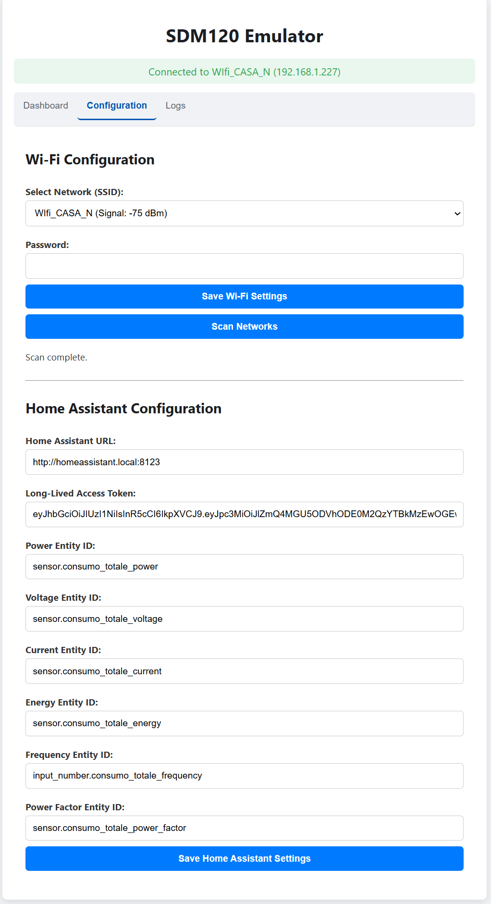
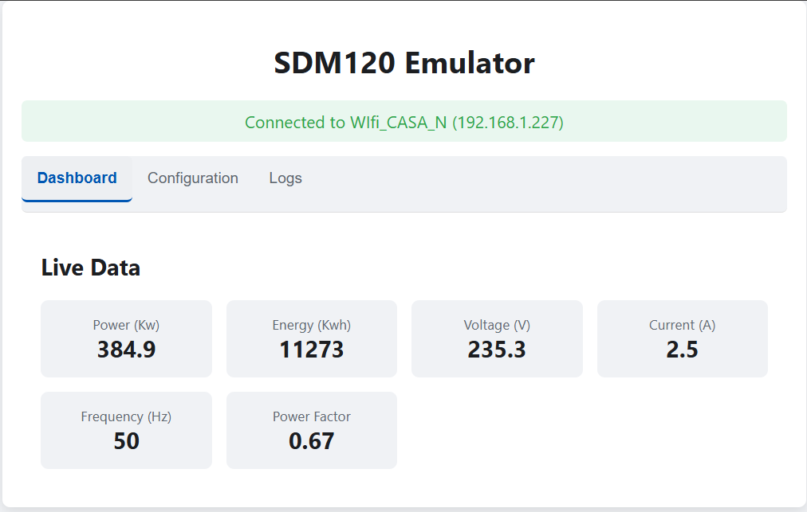
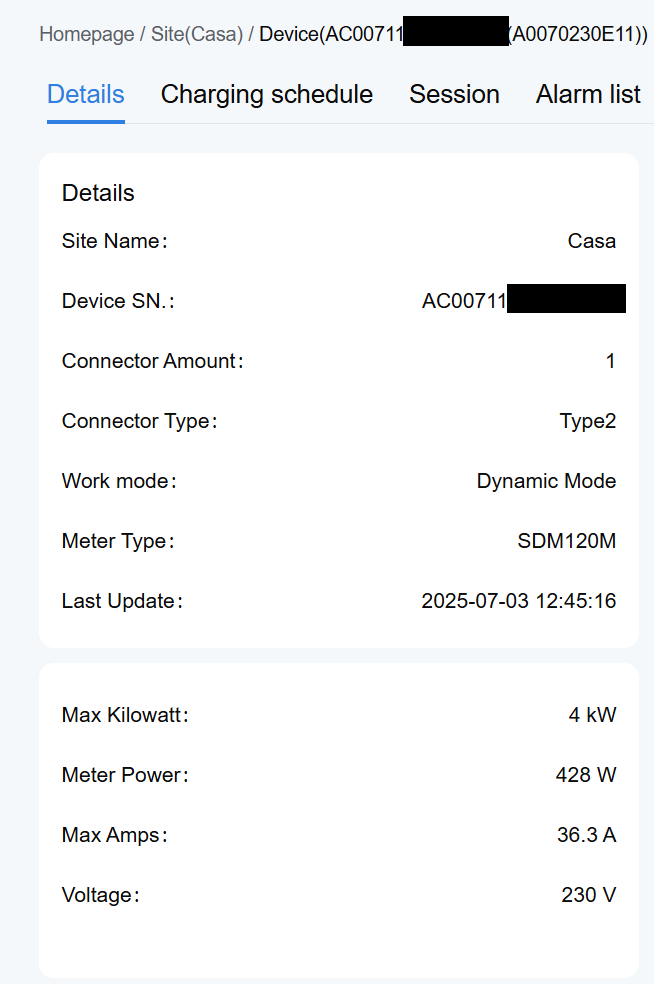

# ESP32 SDM120 Modbus RTU Emulator for Home Assistant


An ESP32-based SDM120 (Modbus RTU) energy meter emulator, designed to integrate with Home Assistant and devices that require an SDM120 meter for load management, such as Livoltek charging stations.

## 🌟 Key Features

* **SDM120 Modbus RTU Emulation:** Simulates an Eastron SDM120 energy meter via Modbus RTU (RS485), providing readings for power, energy, voltage, current, frequency, and power factor.
* **Home Assistant Integration:** Retrieves real-time energy data from specific Home Assistant entities (e.g., smart meter or solar inverter sensors).
* **Web Interface (Captive Portal):** Easy configuration of Wi-Fi network and Home Assistant parameters via an intuitive web interface, accessible through a browser.
* **Automatic Access Point (AP) Mode:** If it fails to connect to the configured Wi-Fi, the ESP32 automatically starts an Access Point to allow reconfiguration.
* **Logging:** Integrated logging system with web visualization and download capability for diagnostics.
* **Livoltek Compatibility:** Specifically designed to address load management issues with Livoltek charging stations that require an SDM120 meter.

## 🎯 Use Case

If you own a charging station (e.g., Livoltek) that requires an SDM120 meter connected via RS485 to dynamically adjust charging power based on household consumption, but you don't have a physical SDM120 or prefer to use data already available in Home Assistant (e.g., from your smart meter or inverter), this project is for you. The ESP32 acts as a bridge, translating Home Assistant data into a format understandable by your Modbus RTU device.

## ⚙️ Project Architecture

The project is divided into modules for better organization and maintainability:

* **`ConfigManager`**: Manages saving and loading configurations (Wi-Fi, Home Assistant) to/from the ESP32's EEPROM.
* **`WiFiManager`**: Handles Wi-Fi connection in Station mode and activates Access Point mode with a Captive Portal for initial setup.
* **`WebServerManager`**: Implements the web server for the user interface, handling HTTP requests for configuration and data/log display.
* **`HomeAssistantClient`**: Responsible for making REST API calls to Home Assistant to retrieve the state of energy entities.
* **`ModbusManager`**: Manages Modbus RTU (RS485) communication as a slave, updating Modbus registers with data received from Home Assistant.
* **`Logger`**: A simple logging system to track operations and facilitate debugging.

## 🔌 Hardware Requirements

* **ESP32 Development Board:** Any ESP32 board compatible with the Arduino environment.
* **RS485 Module (MAX485 or similar):** Required for Modbus RTU communication. Connect `RO` to ESP32's `RX` and `DI` to ESP32's `TX`. `RE` and `DE` pins (Receive Enable and Drive Enable) should be connected together to an ESP32 GPIO pin to control data flow direction.
* **Connection Cables:** For RS485 (A and B) and power.

## ⚡ Wiring Connections

| ESP32 Pin (Example) | RS485 Module Pin  | Description                          |
| :------------------ | :---------------- | :----------------------------------- |
| `GPIO16` (RX2)      | `RO` (Receiver Out) | Data received from RS485 bus         |
| `GPIO17` (TX2)      | `DI` (Driver Input) | Data transmitted to RS485 bus        |
| `GPIO4`             | `RE` & `DE`         | Transmit/Receive Enable (connect together) |
| `GND`               | `GND`             | Ground                               |
| `3.3V` / `5V`       | `VCC`             | Power supply                         |

*Note: The specific GPIO pins (e.g., GPIO16, GPIO17, GPIO4) are examples. Refer to your ESP32 board's pinout and configure them in your `main.ino` file.*

**Note:** The GPIO pins for `RX2`, `TX2`, and `DE_RE` are configurable in the code. Ensure you use ESP32's UART2 pins for Modbus communication.

## 🚀 Installation and Configuration

1.  **IDE Requirements:**
    * Arduino IDE (IDE 2.x recommended) or PlatformIO.
    * Install the Board Manager for ESP32.
    * Required Libraries:
        * `WiFi` (included with ESP32 core)
        * `WebServer` (included with ESP32 core)
        * `HTTPClient` (included with ESP32 core)
        * `EEPROM` (included with ESP32 core)
        * `ArduinoJson` ( https://github.com/bblanchon/ArduinoJson )
        * `ModbusRTU` ( https://github.com/emelianov/modbus-esp8266 ) 

    You can install libraries via the Arduino IDE's Library Manager.

2.  **Project Configuration:**
    * Clone this repository.
    * Open the project in Arduino IDE or PlatformIO.
    * In the main `.ino` file (or `main.cpp` if using PlatformIO), configure the GPIO pins for RS485 communication and the Modbus Slave ID.

    ```cpp
    // Example in your main.ino file
    #define SDM120_SLAVE_ID 1 // The Modbus ID of your emulator (must match the client device's configuration)
    #define RXD2 16           // RX pin for UART2
    #define TXD2 17           // TX pin for UART2
    #define DE_RE_PIN 4       // Pin to control DE/RE of the RS485 module
    #define MODBUS_BAUDRATE 9600 // Baud rate for Modbus communication
    ```

3.  **Upload Firmware:** Upload the code to your ESP32.

4.  **Initial Configuration via Web Interface:**
    * On the first boot, or if it fails to connect to Wi-Fi, the ESP32 will create an Access Point. The AP name will be `SDM120-ESP32_XXXX` (where XXXX are the last digits of the ESP32's MAC address) and the password will be `sdm120pass`.
    * Connect to this AP from your PC or smartphone.
    * Open a browser and navigate to `192.168.4.1`. The configuration interface will appear.
    * In the "Wi-Fi Configuration" section, select your Wi-Fi network and enter the password. Save the settings. The ESP32 will reboot.
    * After reboot, if the Wi-Fi connection is successful, you can access the web interface via the IP address assigned to the ESP32 by your router (you can find it in your router's page or by using a network scanning tool like Fing).
    * In the "Home Assistant Configuration" section, enter:
        * **Home Assistant URL:** The full URL of your Home Assistant instance (e.g., `http://homeassistant.local:8123` or `https://your-domain.duckdns.org`).
        * **Long-Lived Access Token:** A long-lived access token generated in Home Assistant (User Profile -> Long-Lived Access Tokens).
        * **Entity IDs:** The `entity_id`s of your Home Assistant sensors that contain power, energy, voltage, current, frequency, and power factor data. Ensure these sensors provide valid numeric values.

5.  **Physical Connection:** Connect your RS485 module to the ESP32 and then to the Livoltek charging station (or other Modbus client device) using A and B wires.

## 📈 Emulated Modbus Registers (SDM120)

The emulator exposes the following Modbus registers (Input Registers, Function 0x04) to simulate an SDM120. Values are in float (32-bit IEEE 754) format, occupying two 16-bit registers each.

| Address (Decimal) | Address (Hexadecimal) | Description          | Unit  | Data Type         |
| :---------------- | :-------------------- | :------------------- | :---- | :---------------- |
| `0`               | `0x0000`              | Line-to-Neutral Voltage | V     | `float` (2 regs)  |
| `6`               | `0x0006`              | Current              | A     | `float` (2 regs)  |
| `12`              | `0x000C`              | Active Power         | W     | `float` (2 regs)  |
| `18`              | `0x0012`              | Apparent Power       | VA    | `float` (2 regs)  |
| `24`              | `0x0018`              | Reactive Power       | VAR   | `float` (2 regs)  |
| `30`              | `0x001E`              | Power Factor         |       | `float` (2 regs)  |
| `36`              | `0x0024`              | Frequency            | Hz    | `float` (2 regs)  |
| `42`              | `0x002A`              | Phase Angle          | Degrees | `float` (2 regs)  |
| `72`              | `0x0048`              | Total Active Energy  | kWh   | `float` (2 regs)  |

**Note:** Addresses are based on typical SDM120 documentation. The implementation automatically handles the conversion from float to two `uint16_t` values and vice-versa.

## 📸 Photo Gallery

Here you can find some images of the project in action, the hardware setup, and the web interface.

| Description | Image |
| :---------- | :---- |
| ESP32 with RS485 Module |  |
| Wi-Fi And Home Assistant Configuration Web Page |  |
| Real-time Data Dashboard |  |
| Livoltek Web Portal |  |

## 🤝 Contributing

Feel free to open issues, propose improvements, or submit pull requests! All contributions are welcome.

## 📄 License

This project is released under the [MIT License](LICENSE). Apache 2.0